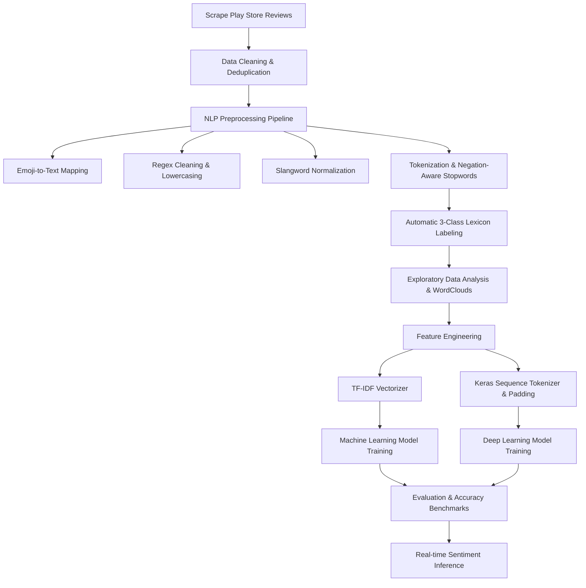

# 📊 JAKI App Reviews Sentiment Analysis
> **An End-to-End Machine Learning & Deep Learning Pipeline for Sentiment Analysis on JAKI (Jakarta Kini) Mobile Application Reviews from the Google Play Store**

[](https://www.python.org/)
[](https://www.tensorflow.org/)
[](https://scikit-learn.org/)

---

## 🚀 About The Project
**JAKI (Jakarta Kini)** is the official integrated public service mobile application developed by the Jakarta Provincial Government. User reviews on the Google Play Store provide valuable insights into user satisfaction, technical glitches (such as system lags or crashes), and the effectiveness of public services.

This project delivers a comprehensive Natural Language Processing (NLP) pipeline to scrape, clean, label, and classify user reviews of the JAKI app into three sentiment categories: **Positive (`positive`)**, **Negative (`negative`)**, and **Neutral (`neutral`)**.

By evaluating 8 different Machine Learning and Deep Learning algorithms, this project benchmarks model performance in understanding informal, slang-heavy Indonesian user feedback.

---

## ✨ Key Features
- **Automated Data Scraping**: Fetches real-time user reviews directly from the Google Play Store using `google-play-scraper`.
- **Indonesian-Specific NLP Preprocessing Pipeline**:
  - Emoji mapping to Indonesian sentiment words (e.g., `👍` &rarr; `bagus`, `😡` &rarr; `marah`).
  - Noise reduction (removal of mentions, hashtags, URLs, numbers, and punctuation).
  - Normalization of informal Indonesian slang (*Slangwords Dictionary*) tailored for government app domains.
  - Stopword filtering with **Negation & Intensity Word Preservation** (`tidak`, `bukan`, `belum`, `sangat`, etc.).
  - Indonesian root word stemming using `Sastrawi`.
- **Automated Lexicon Labeling**: 3-class automatic sentiment tagging leveraging an Indonesian Lexicon corpus with anomaly filtering.
- **Multi-Model Benchmarking (8 Architectures)**: Performance comparisons across Machine Learning algorithms (Logistic Regression, SVM, LinearSVC, LightGBM) and Deep Learning models (LSTM, GRU, BiLSTM, Transformer with Self-Attention).
- **Inference Ready**: Built-in inference function for testing new review strings in real-time.

---

## ⚙️ Workflow & System Architecture

The project follows a standard NLP lifecycle pipeline:



---

## 📊 Dataset Overview

Data was collected from the JAKI application (`id.go.jakarta.smartcity.jaki`) on the Google Play Store.

- **Raw Review Count**: 4,919 rows (11 metadata columns).
- **Cleaned & Deduplicated Count**: 4,123 unique reviews.
- **Class Distribution (Lexicon Labeling Output)**:

| Sentiment Class | Review Count | Percentage | Primary Characteristics |
|---|---|---|---|
| 🔴 **Negative (`negative`)** | 2,587 | 62.7% | Complaints regarding system bugs, lags, errors, verification failures. |
| 🔵 **Positive (`positive`)** | 1.016 | 24.6% | Praises for app features and public service reporting convenience. |
| ⚪ **Neutral (`neutral`)** | 520 | 12.6% | Inquiries, feature suggestions, and neutral feedback. |

---

## 🧹 NLP Preprocessing Pipeline

The text normalization workflow is customized for Indonesian social media and app review registers:

1. **Emoji Transformation**: Emojis are converted into Indonesian sentiment words (e.g., `👍` &rarr; `bagus`, `👎` &rarr; `buruk`, `😊` &rarr; `senang`, `😭` &rarr; `sedih`). Unmapped emojis are removed.
2. **Regex Cleansing**: Strips mentions (`@username`), hashtags (`#tag`), RT symbols, web links, numbers, and special punctuation.
3. **Case Folding**: Converts all text into lowercase.
4. **Slangword Normalization**: Replaces informal/slang words with formal Indonesian (e.g., `utk` &rarr; `untuk`, `lemot` &rarr; `lambat`, `eror` &rarr; `error`, `verif` &rarr; `verifikasi`, `fastrespon` &rarr; `tanggapan cepat`, `mantul` &rarr; `bagus`).
5. **Tokenization & Stopword Filtering**: Splits text into tokens using `nltk.tokenize`. Removes generic Indonesian and English stopwords while **preserving negation and intensity modifiers** (`tidak`, `bukan`, `belum`, `kurang`, `jangan`, `sangat`, `banget`, `sekali`) to retain crucial sentiment context.

---

## 🏆 Experimental Results & Model Benchmarks

Models were evaluated using an 80:20 **Stratified Train-Test Split** (`random_state=42`).

Below is the comparative performance table of all 8 benchmarked models:

| Rank | Model Architecture | Feature Representation | Training Accuracy | Test Accuracy |
|:---:|---|:---:|:---:|:---:|
| 🥇 **1** | **BiLSTM (Bidirectional LSTM)** | Sequence Tokenizer | **96.82%** | **88.36%** |
| 🥈 **2** | **Transformer (Self-Attention)** | Sequence Tokenizer | **97.00%** | **87.88%** |
| 🥉 **3** | **LSTM (Long Short-Term Memory)** | Sequence Tokenizer | **98.03%** | **87.52%** |
| 4 | **GRU (Gated Recurrent Unit)** | Sequence Tokenizer | **98.18%** | **87.03%** |
| 5 | **LinearSVC** | TF-IDF Vectorizer | **98.12%** | **86.91%** |
| 6 | **SVM (Support Vector Machine)** | TF-IDF Vectorizer | **96.60%** | **86.42%** |
| 7 | **Logistic Regression** | TF-IDF Vectorizer | **96.00%** | **85.09%** |
| 8 | **LightGBM Classifier** | TF-IDF Vectorizer | **92.54%** | **83.27%** |

### 💡 Key Findings & Insights:
- **Sequential Deep Learning Models** (BiLSTM & Transformer) consistently outperformed traditional TF-IDF models due to their ability to capture bidirectional contextual dependencies in complex sentences.
- **BiLSTM** achieved the highest test accuracy of **88.36%**.

---

## 🛠️ Installation Guide

### Prerequisites
- Python 3.10 or higher
- Git

### Installation Steps
1. **Clone the Repository**:
   ```bash
   git clone https://github.com/adichondro/JAKI-Sentiment-Analysis.git
   cd JAKI-Sentiment-Analysis
   ```

2. **Create & Activate a Virtual Environment (Recommended)**:
   - **Windows**:
     ```bash
     python -m venv venv
     .\venv\Scripts\activate
     ```
   - **Linux / macOS**:
     ```bash
     python3 -m venv venv
     source venv/bin/activate
     ```

3. **Install Dependencies**:
   ```bash
   pip install -r requirements.txt
   ```

---

## 📖 How to Run

### 1. Data Acquisition (Scraping)
To scrape the latest reviews directly from the Google Play Store, execute the Python script:
```bash
python scraping.py
```
*The output will automatically save to `ulasan_aplikasi_jaki_raw.csv`.*

### 2. Model Training & Evaluation
Open and run [model_training.ipynb](model_training.ipynb) in Jupyter Notebook or Google Colab to execute the full pipeline (preprocessing, WordCloud generation, training 8 models, and accuracy evaluation).

### 3. Real-time Inference
You can test custom review sentences using the inference helper function in the notebook:

```python
# Real-time sentiment prediction using the top-performing model
review_1 = "Aplikasi ini sangat bagus dan ngebantu banget. Mantap JAKI!"
prediction_1 = prediksi_sentimen(review_1, model_terbaik, tokenizer, le, MAX_LEN)
print(f"Review: {review_1} -> Sentiment: {prediction_1}")
# Output: positive

review_2 = "Gimana sih ini apk lemot banget, pas mau verifikasi ktp muter muter terus gajelas"
prediction_2 = prediksi_sentimen(review_2, model_terbaik, tokenizer, le, MAX_LEN)
print(f"Review: {review_2} -> Sentiment: {prediction_2}")
# Output: negative
```

---

## 💻 Tech Stack

| Category | Library / Tool | Purpose |
|---|---|---|
| **Programming Language** | Python 3.10+ | Primary language |
| **Data Scraping** | `google-play-scraper` | Google Play Store review collection |
| **Data Processing** | `pandas`, `numpy` | Data manipulation and analysis |
| **NLP & Text Normalization** | `nltk`, `Sastrawi`, `emoji`, `re` | Tokenization, stopwords, stemming, regex & emojis |
| **Machine Learning** | `scikit-learn`, `lightgbm` | TF-IDF, SVM, LinearSVC, Logistic Regression |
| **Deep Learning** | `tensorflow`, `keras` | Sequence tokenization, LSTM, GRU, BiLSTM, Transformer |
| **Visualization** | `matplotlib`, `seaborn`, `wordcloud` | Charts, distribution plots, and WordClouds |

---

<p align="center">
  <i>Developed by <a href="https://github.com/adichondro">Adi Chondro</a> for Digital Public Service Sentiment Analysis.</i>
</p>
